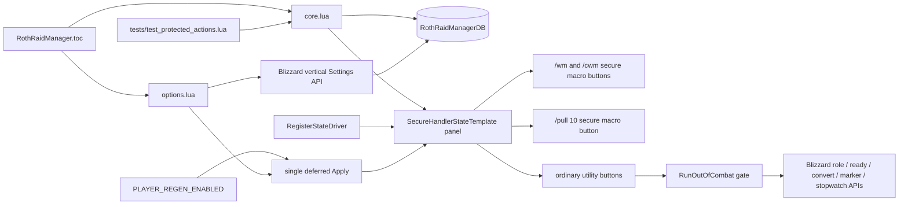

# RothRaidManager code graph

```mermaid
flowchart LR
  T["RothRaidManager.toc"] --> C["core.lua"]
  T --> O["options.lua"]
  C --> DB[("RothRaidManagerDB")]
  C --> P["SecureHandlerStateTemplate panel"]
  P --> WM["/wm and /cwm secure macro buttons"]
  P --> PL["/pull 10 secure macro button"]
  P --> U["ordinary utility buttons"]
  U --> G["RunOutOfCombat gate"]
  G --> B["Blizzard role / ready / convert / marker / stopwatch APIs"]
  S["RegisterStateDriver"] --> P
  R["PLAYER_REGEN_ENABLED"] --> A["single deferred Apply"]
  A --> P
  O --> VS["Blizzard vertical Settings API"]
  VS --> DB
  O --> A
  X["tests/test_protected_actions.lua"] --> C
```

Secure macro attributes are declarative and immutable after initialization. Ordinary utility actions are rejected in combat and are never queued for later execution.
