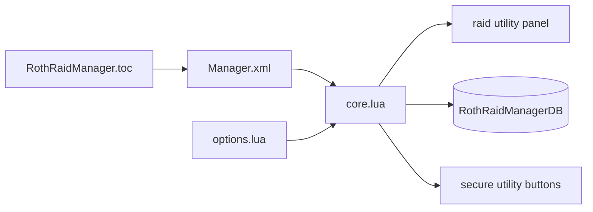

# RothRaidManager code graph

```mermaid
flowchart LR
  T["RothRaidManager.toc"] --> X["Manager.xml"]
  X --> C["core.lua"]
  C --> F["raid utility panel"]
  C --> DB[("RothRaidManagerDB")]
  C --> Q["secure utility buttons"]
  O["options.lua"] --> C
```
